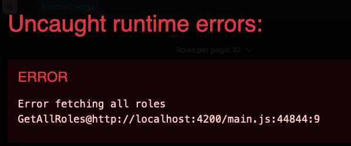

# OpenPRA monorepo

<a href="https://doi.org/10.5281/zenodo.10891407"></a>

Welcome to the OpenPRA monorepo, the unified codebase for the [v2 OpenPRA App](https://v2.app.openpra.org/), which
includes the web client, backend REST APIs, distributed microservices, wrappers for underlying C/C++ quantification
engines, shared JSON schema definitions, and utility packages for automated PRA model generation.

## Internal Packages

Included within this monorepo are the following packages:

- `engine-scram-node`: Node.js wrappers for the `SCRAM` C/C++ engine.
- `frontend-web-editor`: A React v18 and TypeScript-based frontend UI.
- `mef-schema`: OpenPRA MEF JSON Schema definitions, generated using the `shared-types` package.
- `microservice-job-broker`: RabbitMQ based distributed queues for scaling quantification requests.
- `model-generator`: A tool for creating synthetic PRA models.
- `shared-types`: Shared TypeScript type definitions, serving as the single source of truth for all data types.
- `web-backend`: A NestJS REST-API backend service written in TypeScript.

We're managing this monorepo using the [Nx](https://nx.dev) build system, which enables flexible package bundling. For
instance, the `mef-schema` package centralizes the
[OpenPRA-MEF (Model Exchange Format) JSON definitions](https://docs.openpra.org/en/model-exchange-formats), generated
from the TypeScript definitions specified in the `shared-types` package.


# Quick Start Guide

Follow these steps to set up and run the project.

## Prerequisites

Make sure you have the following tools installed on your system:

- **Node.js v20.17.0** (managed via **nvm**)
- **pnpm** (Package Manager)
- **MongoDB**
- **RabbitMQ**

### Installation

1. **Install Homebrew** (if not already installed):
```bash
/bin/bash -c "$(curl -fsSL https://raw.githubusercontent.com/Homebrew/install/HEAD/install.sh)"
```

2. **Install nvm** (Node Version Manager):

#### macOS and Linux

```bash
curl -o- https://raw.githubusercontent.com/nvm-sh/nvm/v0.40.1/install.sh | bash
```

Once installed, `nvm` can be used to download and use the `node` version of choice. Install it using `nvm` with the
following commands:

```bash
source ~/.zshrc  # or source ~/.bashrc
nvm install 20.17.0
nvm use 20.17.0
```

After installation, restart your terminal or run `source ~/.bashrc` (or `source ~/.zshrc` for Zsh).

#### Windows

Download and run the [nvm Windows installer](https://github.com/coreybutler/nvm-windows/releases/latest/download/nvm-setup.zip).


3. Install **pnpm** (Package Manager)

#### macOS and Linux

Run:

```bash
curl -fsSL https://get.pnpm.io/install.sh | sh -
```

Ensure `pnpm` is added to your `PATH`. You may need to restart your terminal or run `source ~/.bashrc` or `source ~/.zshrc`.

#### Windows

Run:

```bash
npm install -g pnpm
```

4. Install MongoDB and RabbitMQ:

```bash
brew tap mongodb/brew
brew install mongodb-community
brew install rabbitmq
```

Follow the official MongoDB installation guide for your operating system:

- **macOS**: [Install MongoDB on macOS](https://docs.mongodb.com/manual/tutorial/install-mongodb-on-os-x/)
- **Windows**: [Install MongoDB on Windows](https://docs.mongodb.com/manual/tutorial/install-mongodb-on-windows/)
- **Linux**: [Install MongoDB on Linux](https://docs.mongodb.com/manual/administration/install-on-linux/)

## Start Services

Once prerequisites are installed, initialize the project with these commands:

```bash
# Start services
brew services start mongodb-community
brew services start rabbitmq
```

```bash
git clone https://github.com/your-repo/openpra-monorepo.git
cd openpra-monorepo
pnpm setup
pnpm install
pnpm install --global nx@19.6.2
```

## Getting Access to SCRAM CLI
Check your architecture
```bash
uname -m
```
For Apple Silicon the steps are as follows: 

add library path
```bash
echo 'export DYLD_LIBRARY_PATH="$HOME/.local/lib/scram:$DYLD_LIBRARY_PATH"' >> ~/.zshrc
```

reload profile
```bash
source ~/.zshrc
```

verify env variable is set
```bash
echo $DYLD_LIBRARY_PATH
```

Access SCRAM-CLI
```bash
scram-cli --help
```


### Running the App

Start all services with minimal logging:
```bash
nx run-many -t serve --all --skip-nx-cache --verbose=false
```
To serve all packages at once, with logging:

```bash
nx run-many -t serve --all
```

The application will be available at:
- Frontend: http://localhost:4200
- Backend: http://localhost:3000
- RabbitMQ Management: http://localhost:15672 (guest/guest)
- MongoDb: http://localhost:27017

> [!NOTE]  
> When you signup at http://localhost:4200, you will get the following error

> 
> This a known routing issue in the app. To proceed forward truncate http://localhost:4200/internal-events to http://localhost:4200 in the browser and you will enter the app. After entering the app click on "Create Internal Events" to proceed

### Troubleshooting

If you encounter service connection errors:

1. **Verify services are running**:
```bash
brew services list
```

2. **Check MongoDB connection**:
```bash
mongosh --eval "db.version()"
```

Other MongoDB related commands
```bash
mongosh "mongodb://localhost:27017"
List databases: show dbs
Use database: use <database_name>
Show collections: show collections
Query collection: db.<collection_name>.find()
```

3. **Check RabbitMQ**:
```bash
rabbitmqctl status
```

4. Try nuking your pnpm setup and try again

Run the following script
> [!NOTE]  - this is destructive behaviour, use with caution


```bash
openpra-monorepo/scripts/rm_node_modules.sh
```
### Start Individual Services

To serve a specific package, run:

- **Web Editor**:

  ```bash
  nx serve frontend-web-editor
  ```

- **Web Backend**:

  ```bash
  nx serve web-backend
  ```

## Development and Testing

### Making Changes

1. Create a new feature branch:
```bash
git checkout -b feature/your-feature-name
```

2. Make your changes and verify locally using one of these approaches:

Test and lint all packages:
```bash
# Run all tests
nx run-many -t test

# Run all linting
nx run-many -t lint
```

Or test only affected packages:
```bash
# Test only changed packages
nx affected:test

# Lint only changed packages
nx affected:lint
```

3. Push your changes:
```bash
git push origin feature/your-feature-name
```

4. Create a pull request from your feature branch to `main`

## Additional Documentation

Additional documentation can be found in the [Extended README](README/README.md)
section.

---

## Citation
```bibtex
@software{openpra_initiative_2024_10891408,
  author       = {OpenPRA Initiative},
  title        = {openpra-org/openpra-monorepo},
  month        = mar,
  year         = 2024,
  publisher    = {Zenodo},
  version      = {v0.1.1},
  doi          = {10.5281/zenodo.10891408},
  url          = {https://doi.org/10.5281/zenodo.10891408}
}
```
## License

MIT
